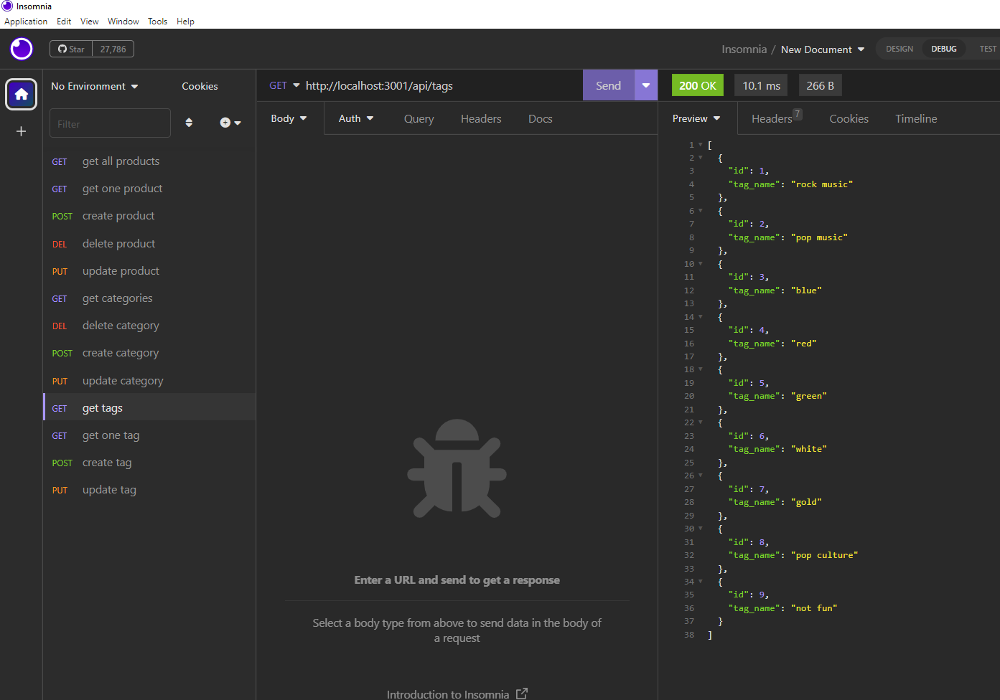

# 13-e-commerece-back-end
CRUD your products until you sell millions! This is a back-end implementation of an e-commerce applicaiton. 

## Description
This app uses node.js and the "sequelize" package to create server with js modeling of MySQL.
The user may create, read, update, or delete entries in the database, which includes tables for products, tags, and categories. 

## Running the application
Install node.js, the dependecies and run server.js.

## Screenshots of the Application

## Repository and Video Demo

The video is available here: [video-demo](https://youtu.be/130txMRfksE)
The repo is available here: [repo](https://github.com/cristino4/13-e-commerce-back-end)

